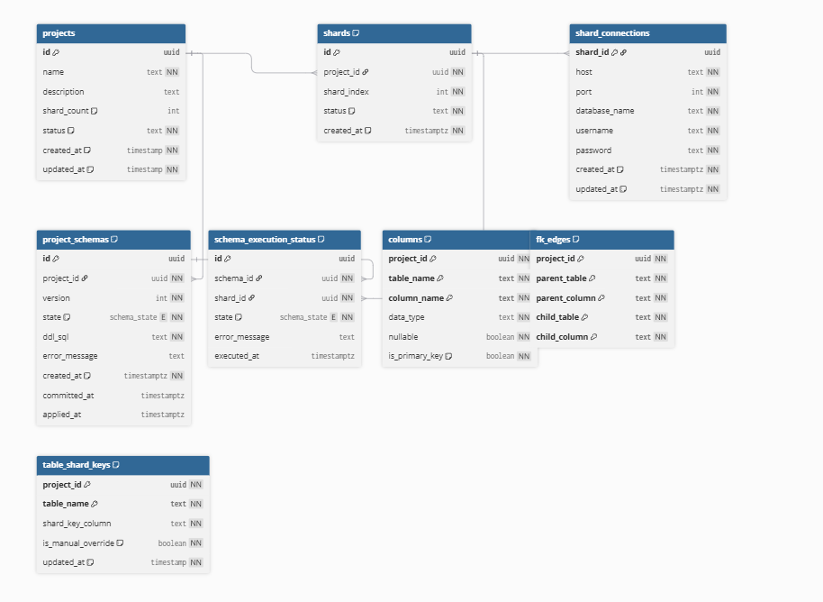
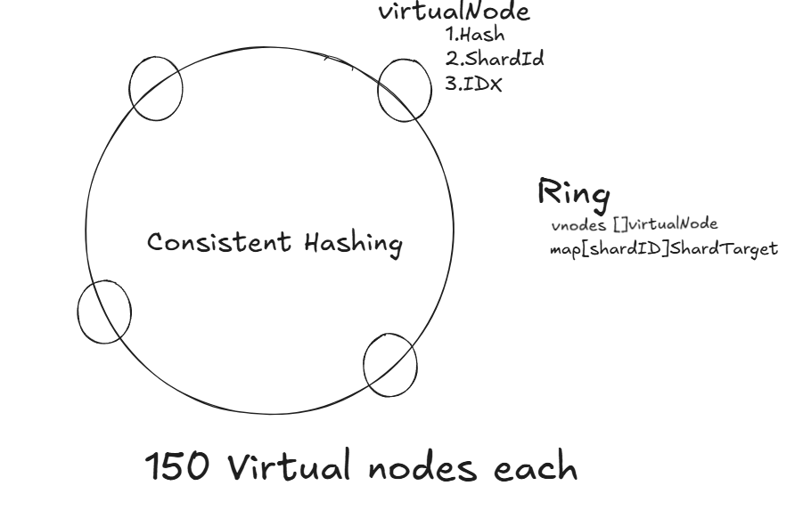

dependencies : 
go get github.com/golang-migrate/migrate/v4  github.com/google/uuid  github.com/lib/pq  github.com/pganalyze/pg_query_go/v5  github.com/joho/godotenv

It parses DDL → walks the AST → emits:

Nodes → []repository.Column
Edges → []repository.FkEdges

Those two slices are the graph in flat form.

Nodes (vertices)
Each column becomes a node:
repository.Column{
    TableName,
    ColumnName,
}

Edges (relationships)
Foreign keys become edges:
repository.FkEdges{
    ChildTable,
    ChildColumn,
    ParentTable,
    ParentColumn,
}

This is effectively:
(child_table.child_column) ───▶ (parent_table.parent_column)
directed edge

DB-friendly flat data, not an in-memory graph 

AST traversal → Graph extraction
still flat representation, not adjacency list

everytime replace instead of update
Graph must be consistent snapshot
This avoids:
orphan edges
partial updates
schema drift bugs

Graph Algorithm #1 : tc -> O(n)
Fanout (fanout.go)
In-degree (classic graph metric)
s.IncomingFkCount++

Unique neighbor count
childTableSets[parent][fk.ChildTable]

Graph Algorithm #2 : tc -> O(n^3)
Ranking (ranker.go)
In-degree centrality IncomingFkCount * 10
Breadth of influence ReferencingTableCount * 5
Reverse edge signal(FK child) if isFKChild → +20
Root Affinity Second-order graph traversal
basically checking : child → parent → parent's importance
Propagation of centrality (like PageRank-lite)

Primary Key bonus +10
Penalty (data distribution) text → -15

Sorting
sort.SliceStable
Ensures:
deterministic output
avoids Go map randomness

Graph Construction
AST traversal
Builds edge list
2. Degree Centrality
IncomingFkCount
3. Neighborhood Analysis
ReferencingTableCount
4. Reverse Edge Detection
isFKChild
5. 2-Hop Traversal
child → parent → fanout(parent)

That’s:

Second-order dependency analysis

6. Weighted Scoring Model

This is:

Heuristic centrality ranking

(Not pure PageRank, but similar intuition)

🔥 The Hidden Design (Very Important)

You have decoupled the system perfectly:

Layer 1 — Extraction
DDL → AST → (columns, edges)
Layer 2 — Storage
edges → DB (cached graph)
Layer 3 — Computation
edges → fanout stats
Layer 4 — Decision
fanout + metadata → shard key

Stateless computation

You can recompute anytime

 DB as graph cache

No need to rebuild from SQL every time

 O(n) algorithms

Scales well

 Extensible

You can easily add:

join cost estimation
query routing
lineage tracking

Converting SQL schema → Graph → Graph analytics → Shard key decision

DDL (SQL)
  ↓
AST (pg_query)
  ↓
Graph Extraction (nodes + edges)
  ↓
Graph Storage (DB as cache)
  ↓
Graph Analysis (fanout)
  ↓
Graph Scoring (centrality + heuristics)
  ↓
Shard Key Decision

FNV-1a Hash :
Deterministic
simple XOR + multiply
Good distribution (spreads values well across the 64-bit space:)

consistent hashing ring
Each real shard is represented by many virtual nodes (150 duplicate virtual nodes for load distribution)
With virtual nodes:

3 shards × 150 = 450 points
Keys get distributed much more evenly

vnodes: sorted list of all virtual nodes (this IS the ring)
shards: map of shardID → actual shard

sorted by hash value for reducing search time by runnning BS over  hash to find the first vnode whose hash ≥ key hash
<!-- O(N × V log(N × V))
N = shards, V = 150 -->
Minimal Data Movement : 
adding/removing shard:
Only nearby keys move
~ 1/N keys affected

join:-shuffle,non collocated